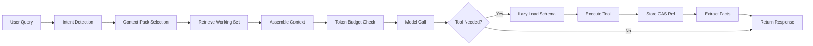

# Context Strategy v1 — Token-Efficient Cross-Request Context Management

**Status**: Draft for implementation
**Scope**: Agent Core (Pydantic-AI + MCP), cache layer (PostgreSQL), background workers
**Primary Goal**: Reduce cross-request input tokens per turn by ≥70% while preserving answer quality and continuity
**Target**: <100k tokens/session and <3k tokens per turn

## Executive Summary

Our current cache implementation reduces latency and API calls but doesn't significantly reduce token usage because:
- Tool schemas are sent with every request (~500-1000 tokens)
- Full conversation history accumulates across requests
- Tool results are stored verbatim without compression
- No cross-request optimization for common queries

This strategy introduces a comprehensive context management system that achieves real token savings through:
1. **Stable prefix with tool directory** (names only, no schemas)
2. **Query-aware context packs** (load only relevant context)
3. **Facts ledger** (extracted nuggets with pgvector retrieval)
4. **Progressive compression** (older messages get smaller)
5. **Content-addressable storage** (CAS refs instead of full results)
6. **Lazy tool schema loading** (only load when needed)
7. **Semantic answer cache** (bypass LLM for common queries)

## 1. Design Principles

### 1.1 Core Tenets
- **Minimize what we send, not just what we fetch** - Tool caching cuts latency; real token savings come from context selection + compression
- **Make big pieces stable** - Keep a stable header across turns (eligible for vendor prompt-caching)
- **Prefer zero-LLM compression** - Use deterministic extraction whenever possible
- **Reference, don't repeat** - Send tiny summaries + content-addressable refs instead of full payloads
- **Pay once, reuse many** - Hash content to avoid recomputing summaries

### 1.2 Constraints
- Must maintain conversation continuity across devices
- Cannot block request path with expensive operations
- Must gracefully degrade when budgets exceeded
- Should be backward compatible with existing chat API

## 2. Context Structure Per Turn

### 2.1 Stable Header Block (≤600 tokens)
```
- System rules (concise version)
- Tool Directory: names + one-line intents only
- User profile mini-card (project, timezone, role) - max 100 tokens
```

### 2.2 Dynamic Working Set (≤2,400 tokens)
```
- Last 4-8 message pairs (compressed if old)
- Facts Ledger top-K (8-20 nuggets) relevant to query
- Summaries + CAS refs for "hot" artifacts
- On-demand tool schemas (lazy-loaded when used)
```

**Total Budget Target**: ≤3,000 input tokens per turn

## 3. Data Models

### 3.1 Facts Ledger (pgvector)
```sql
-- Tiny, reusable nuggets extracted from history/results
CREATE TABLE facts_ledger (
  id UUID PRIMARY KEY DEFAULT gen_random_uuid(),
  session_id UUID NOT NULL,
  user_id UUID,
  workspace_id UUID,
  kind TEXT NOT NULL,              -- 'decision' | 'entity' | 'task' | 'metric' | 'link' | 'fact'
  text TEXT NOT NULL,              -- 1-3 bullet lines max
  source_ref TEXT NOT NULL,        -- CAS ref or message id
  topic_tags TEXT[] DEFAULT '{}',  -- ['project:alfred', 'github', 'notion']
  created_at TIMESTAMPTZ DEFAULT now(),
  decay_weight REAL DEFAULT 1.0,   -- For time-based relevance
  embedding VECTOR(768),            -- For semantic search

  CONSTRAINT facts_text_limit CHECK (char_length(text) <= 500)
);

-- Indexes for performance
CREATE INDEX facts_session_idx ON facts_ledger(session_id);
CREATE INDEX facts_user_workspace_idx ON facts_ledger(user_id, workspace_id);
CREATE INDEX facts_tags_idx ON facts_ledger USING GIN (topic_tags);
CREATE INDEX facts_embedding_idx ON facts_ledger USING ivfflat (embedding vector_cosine_ops);
CREATE INDEX facts_created_idx ON facts_ledger(created_at DESC);
```

### 3.2 Content-Addressable Storage (CAS)
```sql
-- Large artifacts stored once, referenced many times
CREATE TABLE cas_refs (
  ref_id TEXT PRIMARY KEY,         -- 'ref:<kind>:<sha256>[:view]'
  kind TEXT NOT NULL,              -- 'github_search' | 'notion_page' | 'email_list'
  content_hash TEXT NOT NULL,      -- sha256 of canonical JSON
  created_at TIMESTAMPTZ DEFAULT now(),
  ttl_expires_at TIMESTAMPTZ,

  -- Compressed representations
  summary TEXT,                    -- 50-120 tokens, human-readable
  compressed JSONB,                -- Zero-LLM compressed view
  full_content JSONB,              -- Full payload (or pointer to blob storage)

  -- Metadata
  freshness_score REAL DEFAULT 1.0,
  access_count INT DEFAULT 0,
  last_accessed_at TIMESTAMPTZ,
  source_meta JSONB,               -- {org, repo, page_id, updated_at}

  CONSTRAINT summary_size CHECK (char_length(summary) <= 500)
);

CREATE INDEX cas_hash_idx ON cas_refs(content_hash);
CREATE INDEX cas_kind_idx ON cas_refs(kind);
CREATE INDEX cas_ttl_idx ON cas_refs(ttl_expires_at) WHERE ttl_expires_at IS NOT NULL;
```

### 3.3 Summarization Queue
```sql
-- Write-behind worker queue for expensive operations
CREATE TABLE summarize_jobs (
  id BIGSERIAL PRIMARY KEY,
  ref_id TEXT NOT NULL REFERENCES cas_refs(ref_id),
  priority SMALLINT DEFAULT 5,
  state TEXT NOT NULL DEFAULT 'queued',  -- queued | running | done | failed | skipped
  attempt_count INT DEFAULT 0,
  max_attempts INT DEFAULT 3,
  next_attempt_at TIMESTAMPTZ DEFAULT now(),
  error_message TEXT,
  completed_at TIMESTAMPTZ,
  token_cost INT                         -- Track actual cost
);

CREATE INDEX jobs_queue_idx ON summarize_jobs(state, priority DESC, next_attempt_at)
  WHERE state IN ('queued', 'failed');
```

### 3.4 Tool Schema Registry
```sql
-- Cached tool schemas for lazy loading
CREATE TABLE tool_schemas (
  tool_name TEXT PRIMARY KEY,
  server_name TEXT NOT NULL,
  schema_json JSONB NOT NULL,
  version TEXT NOT NULL DEFAULT 'v1',
  schema_hash TEXT NOT NULL,
  token_count INT,                       -- Pre-calculated
  updated_at TIMESTAMPTZ DEFAULT now()
);

CREATE INDEX schemas_server_idx ON tool_schemas(server_name);
```

### 3.5 Semantic Answer Cache
```sql
-- Cache complete answers for common queries
CREATE TABLE semantic_cache (
  cache_key TEXT PRIMARY KEY,            -- hash(query + context_signature)
  query_text TEXT NOT NULL,
  query_embedding VECTOR(768),
  answer_text TEXT NOT NULL,
  context_signature TEXT NOT NULL,       -- Hash of context pack used
  used_refs TEXT[] DEFAULT '{}',         -- CAS refs that must be fresh
  created_at TIMESTAMPTZ DEFAULT now(),
  ttl_expires_at TIMESTAMPTZ,
  hit_count INT DEFAULT 0,
  last_hit_at TIMESTAMPTZ
);

CREATE INDEX semantic_embedding_idx ON semantic_cache USING ivfflat (query_embedding vector_cosine_ops);
CREATE INDEX semantic_ttl_idx ON semantic_cache(ttl_expires_at) WHERE ttl_expires_at IS NOT NULL;
```

## 4. API Contracts

### 4.1 Context Assembly
```python
@dataclass
class AssembleContextInput:
    session_id: str
    user_turn: str
    intent: Literal['quick_capture', 'context_lookup', 'deep_analysis', 'planning']
    topic_tags: Optional[List[str]] = None
    token_budget: int = 3000
    force_refresh: bool = False

@dataclass
class AssembledContext:
    header: List[Message]          # System + tool directory
    working_set: List[Message]     # Recent pairs + facts + summaries
    budget: BudgetInfo
    lazy_tools: List[str]          # Tools available for expansion
    cache_key: str                 # For semantic caching

@dataclass
class BudgetInfo:
    used: int
    limit: int
    warnings: List[str]
```

### 4.2 CAS Reference Tool
```python
# Tool the model can call to expand references
async def expand_ref(
    ref_id: str,
    options: Optional[Dict] = None
) -> Dict:
    """
    Expand a CAS reference to get more details.

    Args:
        ref_id: Reference ID like 'ref:github_search:abc123'
        options: {
            'fields': ['specific', 'fields'],  # Return only these
            'slice': {'offset': 0, 'limit': 10}  # For pagination
        }

    Returns:
        Expanded content with requested fields/slice
    """
```

### 4.3 Facts Retrieval
```python
async def get_top_facts(
    query: str,
    session_id: str,
    tags: Optional[List[str]] = None,
    k: int = 12
) -> List[Fact]:
    """
    Retrieve most relevant facts using pgvector similarity.

    Returns facts sorted by:
    1. Semantic similarity to query
    2. Tag overlap
    3. Recency (with decay)
    """
```

## 5. Processing Pipelines

### 5.1 Request Pipeline (Critical Path)


### 5.2 Lazy Tool Schema Loading
```python
async def handle_tool_decision(model_output):
    """Two-phase tool loading to save tokens"""
    if model_output.needs_tool:
        # Phase 1: Model selected a tool from directory
        tool_name = model_output.selected_tool

        # Phase 2: Inject full schema and execute
        schema = await load_tool_schema(tool_name)
        enriched_context = inject_schema(context, schema)
        result = await execute_tool(tool_name, model_output.args)

        # Store result efficiently
        cas_ref = await store_cas(result)
        await extract_facts(result, cas_ref)

        return continue_with_result(cas_ref.summary)
```

### 5.3 Background Pipeline (Non-Critical)
```python
async def summarization_worker():
    """Runs continuously, processing queue"""
    while True:
        job = await fetch_next_job()
        if not job:
            await sleep(5)
            continue

        # Check quotas
        if daily_tokens_used >= DAILY_LIMIT:
            await mark_skipped(job, "quota_exceeded")
            continue

        # Check if already summarized (by hash)
        if await summary_exists(job.content_hash):
            await mark_done(job, cached=True)
            continue

        # Generate summary with small model
        summary = await generate_summary(
            content=job.content,
            max_tokens=120,
            model="gpt-3.5-turbo"  # Cheap, fast
        )

        await store_summary(job.ref_id, summary)
        await mark_done(job)
```

## 6. Compression Strategies

### 6.1 Zero-LLM Compression (Deterministic)
```python
def compress_github_search(result: dict) -> dict:
    """Extract key fields without LLM"""
    items = result.get('items', [])[:10]
    return {
        'count': result.get('total_count', len(items)),
        'top': [{
            'full_name': i['full_name'],
            'url': i['html_url'],
            'stars': i.get('stargazers_count', 0),
            'updated': i.get('updated_at', '')[:10]  # Just date
        } for i in items],
        'more': max(0, result.get('total_count', 0) - 10)
    }

def compress_notion_page(page: dict) -> dict:
    """Extract structure without content"""
    return {
        'title': extract_title(page),
        'id': page['id'],
        'url': page['url'],
        'type': page.get('object', 'page'),
        'last_edited': page.get('last_edited_time', '')[:10],
        'word_count': estimate_words(page),
        'has_children': len(page.get('children', [])) > 0
    }
```

### 6.2 Progressive Message Compression
```python
def compress_message_by_age(message: dict, age: int) -> dict:
    """Older messages get more compressed"""
    if age < 2:
        return message  # Keep recent messages intact
    elif age < 5:
        # Light compression
        return {
            'role': message['role'],
            'content': truncate_middle(message['content'], 300)
        }
    else:
        # Heavy compression
        return {
            'role': message['role'],
            'content': one_line_summary(message['content'])
        }
```

## 7. Token Budgeting

### 7.1 Budget Allocation
```python
TOKEN_BUDGET = {
    'total': 3000,
    'header': 600,
    'history': 1000,
    'facts': 800,
    'summaries': 600
}

def enforce_budget(context: AssembledContext) -> AssembledContext:
    """Trim context to fit budget"""
    current = count_tokens(context)

    if current <= TOKEN_BUDGET['total']:
        return context

    # Trimming priority (least important first)
    trim_order = [
        'oldest_history',
        'low_similarity_facts',
        'stale_summaries',
        'extra_facts_beyond_10'
    ]

    for target in trim_order:
        context = trim_target(context, target)
        if count_tokens(context) <= TOKEN_BUDGET['total']:
            break

    return context
```

### 7.2 Quotas
```python
QUOTAS = {
    'summarization': {
        'per_session': 5000,
        'per_day': 50000,
        'per_artifact': 120
    },
    'semantic_cache': {
        'similarity_threshold': 0.97,
        'max_age_seconds': 3600
    }
}
```

## 8. Implementation Plan

### Phase A: Foundation (Week 1)
- [ ] Database migrations for all tables
- [ ] Implement zero-LLM extractors for top 3 tools
- [ ] Create Tool Directory generator
- [ ] Remove full schemas from default context

### Phase B: Context Packs & Facts (Week 1-2)
- [ ] Implement intent detection
- [ ] Build context pack templates
- [ ] Create facts extraction pipeline
- [ ] Add facts retrieval with pgvector

### Phase C: CAS & Compression (Week 2)
- [ ] Implement CAS storage system
- [ ] Add content hashing and deduplication
- [ ] Build compression pipelines
- [ ] Create expand_ref tool

### Phase D: Lazy Loading & Workers (Week 3)
- [ ] Implement lazy tool schema loading
- [ ] Create summarization worker
- [ ] Add quota management
- [ ] Build delta summarization

### Phase E: Semantic Cache & Optimization (Week 3-4)
- [ ] Implement semantic answer cache
- [ ] Add cache invalidation logic
- [ ] Create monitoring dashboards
- [ ] Performance tuning

### Phase F: Testing & Rollout (Week 4)
- [ ] A/B quality testing
- [ ] Load testing with token metrics
- [ ] Gradual rollout with feature flags
- [ ] Documentation and training

## 9. Integration Points

### 9.1 Agent Orchestrator Changes
```python
# src/services/agent_orchestrator.py
class AgentOrchestrator:
    async def chat(self, request: ChatRequest):
        # NEW: Assemble optimized context
        context = await self.context_manager.assemble(
            session_id=request.context_id,
            user_turn=request.prompt,
            intent=detect_intent(request.prompt)
        )

        # NEW: Check semantic cache first
        if cached := await self.semantic_cache.get(request.prompt, context.cache_key):
            return cached

        # Continue with model call using optimized context
        result = await self.agent.run(
            prompt=request.prompt,
            context=context,
            toolsets=self.get_lazy_toolsets()  # NEW: Lazy loading
        )
```

### 9.2 MCP Router Changes
```python
# src/services/mcp_router.py
class MCPRouter:
    async def call_tool(self, tool_name: str, args: dict):
        result = await self.execute_tool(tool_name, args)

        # NEW: Store in CAS and extract facts
        cas_ref = await self.cas_store.store(result)
        await self.facts_extractor.extract(result, cas_ref.ref_id)

        # NEW: Queue summarization if needed
        if self.should_summarize(result):
            await self.queue_summarization(cas_ref.ref_id)

        return cas_ref.summary  # Return summary instead of full result
```

### 9.3 Cache Service Extension
```python
# src/services/cache_service.py
class CacheService:
    # Extend existing cache with CAS capabilities
    async def store_cas(self, content: dict, kind: str) -> CASRef:
        content_hash = hashlib.sha256(
            canonical_json(content).encode()
        ).hexdigest()

        # Check if already exists
        if existing := await self.get_by_hash(content_hash):
            return existing

        # Create new CAS entry
        ref_id = f"ref:{kind}:{content_hash[:16]}"
        compressed = self.compress(content, kind)

        await self.db.execute("""
            INSERT INTO cas_refs (ref_id, kind, content_hash, compressed, full_content)
            VALUES ($1, $2, $3, $4, $5)
        """, ref_id, kind, content_hash, compressed, content)

        return CASRef(ref_id, compressed, summary=None)
```

## 10. Monitoring & Observability

### 10.1 Key Metrics
```python
METRICS = {
    'token_efficiency': {
        'avg_input_tokens_per_turn': 'P50/P90 ≤ 3000',
        'cache_hit_rate': '≥ 15% for semantic cache',
        'lazy_schema_rate': '≥ 70% of tool uses',
        'compression_ratio': '≥ 70% reduction'
    },
    'performance': {
        'facts_retrieval_p90': '≤ 20ms',
        'context_assembly_p90': '≤ 50ms',
        'summarization_queue_depth': '≤ 100'
    },
    'cost': {
        'daily_summarization_tokens': '≤ 50k',
        'per_session_tokens': '≤ 100k'
    }
}
```

### 10.2 Dashboards
- Token usage by component (header, history, facts, summaries)
- Cache hit rates (semantic, CAS, tool results)
- Compression effectiveness by content type
- Budget warnings and overruns
- Quality metrics (A/B comparison)

## 11. Quality Assurance

### 11.1 Regression Testing
```python
# Test suite comparing full vs. compressed context
test_cases = [
    "Search GitHub for alfred-system",
    "What did we discuss about caching?",
    "Create a task for implementing context strategy",
    "Summarize the last hour of work"
]

for case in test_cases:
    full_response = await test_with_full_context(case)
    compressed_response = await test_with_compressed_context(case)
    assert similarity(full_response, compressed_response) > 0.95
```

### 11.2 Safety Checks
- Never compress error messages or security warnings
- Preserve exact values for IDs, URLs, and references
- Maintain audit trail of compressions
- Flag any PII before compression

## 12. Failure Modes & Recovery

### 12.1 Graceful Degradation
```python
async def handle_budget_exceeded():
    # Minimum viable context
    return {
        'header': system_message_critical_only(),
        'working_set': [
            current_user_message(),
            last_assistant_message()
        ],
        'warning': "Context trimmed due to token limit"
    }

async def handle_missing_summary():
    # Use compressed extract immediately
    # Queue background summarization
    return compressed_extract

async def handle_stale_ref():
    # Mark as stale in UI
    # Allow manual refresh via expand_ref
    return f"{summary} [stale - use expand_ref to refresh]"
```

## 13. Migration Strategy

### 13.1 Database Migrations
```sql
-- Run in order
ALTER TABLE cache_entries ADD COLUMN content_hash TEXT;
CREATE INDEX cache_hash_idx ON cache_entries(content_hash);

-- After testing
ALTER TABLE cache_entries ADD COLUMN compressed JSONB;
ALTER TABLE cache_entries ADD COLUMN summary TEXT;

-- Backfill existing entries
UPDATE cache_entries
SET content_hash = encode(sha256(value::text::bytea), 'hex')
WHERE content_hash IS NULL;
```

### 13.2 Feature Flags
```python
FEATURE_FLAGS = {
    'use_tool_directory': True,        # Phase A
    'enable_facts_ledger': False,      # Phase B
    'enable_cas_refs': False,          # Phase C
    'enable_lazy_schemas': False,      # Phase D
    'enable_semantic_cache': False,    # Phase E
}
```

## 14. Success Criteria

### 14.1 Quantitative
- [ ] Average input tokens per turn ≤ 3,000 (P90)
- [ ] Token reduction vs. baseline ≥ 70%
- [ ] Semantic cache hit rate ≥ 15%
- [ ] Facts retrieval latency ≤ 20ms (P90)
- [ ] Daily summarization cost ≤ $5

### 14.2 Qualitative
- [ ] No degradation in answer quality (human eval)
- [ ] Improved response latency (user perception)
- [ ] Seamless cross-device continuity
- [ ] Clear token usage visibility

## 15. Appendix

### A. Example Context Assembly
```python
# Before (5,000+ tokens)
context = [
    full_system_prompt,           # 500 tokens
    all_tool_schemas,            # 1500 tokens
    entire_conversation_history,  # 2000 tokens
    last_tool_results,           # 1000 tokens
]

# After (≤3,000 tokens)
context = [
    minimal_system_prompt,        # 200 tokens
    tool_directory_names_only,    # 100 tokens
    compressed_recent_history,    # 800 tokens
    top_k_facts,                 # 600 tokens
    cas_summaries,               # 300 tokens
    # Lazy load schemas only when needed
]
```

### B. Cost-Benefit Analysis
```
Summarization cost: ~$0.001 per artifact (GPT-3.5)
Token savings: ~500-1000 tokens per reuse
Break-even: 2-3 reuses per artifact
Expected reuse: 5-10 times per session
ROI: 200-500% token cost reduction
```

### C. References
- [Anthropic Prompt Caching](https://docs.anthropic.com/claude/docs/prompt-caching)
- [OpenAI Semantic Cache Pattern](https://platform.openai.com/docs/guides/caching)
- [pgvector Documentation](https://github.com/pgvector/pgvector)
- [Context Engineering for AI Agents](https://manus.im/blog/Context-Engineering-for-AI-Agents)
