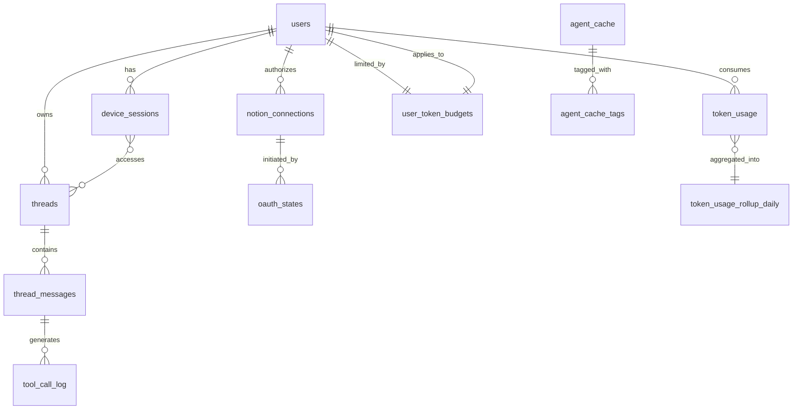

# Database Schema Documentation

## Overview

Alfred Agent Core uses PostgreSQL with SQLAlchemy ORM for persistent storage. The database design follows these principles:

- **Security First**: OAuth tokens and sensitive data encrypted at rest using Fernet symmetric encryption
- **Performance**: Strategic indexes, JSONB for flexible schemas, materialized views for aggregations
- **Scalability**: Partitioning-ready design, efficient foreign keys, careful constraint placement
- **Auditability**: Comprehensive timestamps, soft deletes where appropriate, change tracking

## Entity Relationship Diagram



## Database Tables

### 1. `users`
**Purpose**: Core user account management and authentication

| Column | Type | Constraints | Description |
|--------|------|-------------|-------------|
| `id` | UUID | PRIMARY KEY, DEFAULT uuid_generate_v4() | Unique user identifier |
| `email` | CITEXT | UNIQUE, NOT NULL | Case-insensitive email |
| `status` | ENUM | NOT NULL, DEFAULT 'active' | active\|inactive\|suspended |
| `created_at` | TIMESTAMPTZ | NOT NULL, DEFAULT NOW() | Account creation time |
| `updated_at` | TIMESTAMPTZ | NOT NULL, DEFAULT NOW() | Last modification time |

**Indexes**:
- `idx_users_email` (UNIQUE) on `email`
- `idx_users_status` on `status` for filtering active users

**Security**: Email stored as CITEXT for case-insensitive uniqueness

---

### 2. `device_sessions`
**Purpose**: Device-specific session management for stateless API

| Column | Type | Constraints | Description |
|--------|------|-------------|-------------|
| `id` | UUID | PRIMARY KEY | Session identifier |
| `user_id` | UUID | FOREIGN KEY → users.id, NULL | Optional user binding |
| `device_token` | VARCHAR(255) | UNIQUE, NOT NULL | Client device identifier |
| `thread_id` | UUID | FOREIGN KEY → threads.id | Active thread |
| `workspace_id` | VARCHAR(255) | NULL | Active Notion workspace |
| `last_activity` | TIMESTAMPTZ | NOT NULL | Last API interaction |
| `metadata` | JSONB | DEFAULT '{}' | Client metadata |
| `created_at` | TIMESTAMPTZ | NOT NULL | Session start |
| `expires_at` | TIMESTAMPTZ | NULL | Session expiration |

**Indexes**:
- `idx_device_sessions_token` (UNIQUE) on `device_token`
- `idx_device_sessions_user` on `user_id`
- `idx_device_sessions_activity` on `last_activity` for cleanup

**Cascade Rules**:
- ON DELETE CASCADE from `users`
- ON DELETE SET NULL from `threads`

---

### 3. `notion_connections`
**Purpose**: Encrypted OAuth token storage for Notion integration

| Column | Type | Constraints | Description |
|--------|------|-------------|-------------|
| `id` | UUID | PRIMARY KEY | Connection identifier |
| `user_id` | UUID | FOREIGN KEY → users.id | Token owner |
| `workspace_id` | VARCHAR(255) | NOT NULL | Notion workspace ID |
| `workspace_name` | VARCHAR(255) | NULL | Human-readable name |
| `bot_id` | VARCHAR(255) | NULL | Notion bot ID |
| `access_token_enc` | BYTEA | NOT NULL | Fernet-encrypted token |
| `refresh_token_enc` | BYTEA | NULL | Fernet-encrypted refresh |
| `expires_at` | TIMESTAMPTZ | NULL | Token expiration |
| `is_active` | BOOLEAN | DEFAULT true | Connection status |
| `last_refreshed_at` | TIMESTAMPTZ | NULL | Last refresh attempt |
| `refresh_failure_count` | INTEGER | DEFAULT 0 | Consecutive failures |
| `created_at` | TIMESTAMPTZ | NOT NULL | First authorization |
| `updated_at` | TIMESTAMPTZ | NOT NULL | Last modification |

**Indexes**:
- `idx_notion_connections_user_workspace` (UNIQUE) on `(user_id, workspace_id)` where `bot_id IS NOT NULL`
- `idx_notion_connections_expires` on `expires_at` for refresh scheduling
- `idx_notion_connections_active` on `is_active, user_id`

**Security**:
- Tokens encrypted using Fernet with key from `FERNET_KEY` env var
- Key rotation procedure: Decrypt with old key, re-encrypt with new key in transaction
- Automatic invalidation after 3 consecutive refresh failures

**Unique Constraint**:
- Only one connection per (user, workspace) when bot_id is present
- Allows NULL bot_id for legacy/migration states

---

### 4. `oauth_states`
**Purpose**: CSRF protection for OAuth authorization flows

| Column | Type | Constraints | Description |
|--------|------|-------------|-------------|
| `id` | UUID | PRIMARY KEY | State identifier |
| `state` | VARCHAR(255) | UNIQUE, NOT NULL | Random state token |
| `provider` | VARCHAR(50) | NOT NULL | OAuth provider (notion) |
| `user_id` | UUID | FOREIGN KEY → users.id, NULL | Initiating user |
| `device_token` | VARCHAR(255) | NULL | Device identifier |
| `redirect_uri` | TEXT | NOT NULL | Callback URL |
| `metadata` | JSONB | DEFAULT '{}' | Flow metadata |
| `created_at` | TIMESTAMPTZ | NOT NULL | Flow initiation |
| `expires_at` | TIMESTAMPTZ | NOT NULL | State expiration (5 min) |

**Indexes**:
- `idx_oauth_states_state` (UNIQUE) on `state`
- `idx_oauth_states_expires` on `expires_at` for cleanup

**Security**:
- State tokens: 32-byte random, URL-safe base64
- Automatic expiration after 5 minutes
- One-time use enforced via deletion on callback

---

### 5. `threads`
**Purpose**: Conversation thread management for continuity

| Column | Type | Constraints | Description |
|--------|------|-------------|-------------|
| `id` | UUID | PRIMARY KEY | Thread identifier |
| `user_id` | UUID | FOREIGN KEY → users.id, NULL | Thread owner |
| `title` | VARCHAR(255) | NULL | Auto-generated title |
| `model` | VARCHAR(100) | NOT NULL | AI model used |
| `metadata` | JSONB | DEFAULT '{}' | Thread context |
| `created_at` | TIMESTAMPTZ | NOT NULL | Thread creation |
| `updated_at` | TIMESTAMPTZ | NOT NULL | Last activity |
| `last_message_at` | TIMESTAMPTZ | NULL | Last message time |
| `message_count` | INTEGER | DEFAULT 0 | Total messages |

**Indexes**:
- `idx_threads_user` on `user_id`
- `idx_threads_updated` on `updated_at DESC`
- `idx_threads_last_message` on `last_message_at DESC NULLS LAST`

---

### 6. `thread_messages`
**Purpose**: Message history within threads

| Column | Type | Constraints | Description |
|--------|------|-------------|-------------|
| `id` | UUID | PRIMARY KEY | Message identifier |
| `thread_id` | UUID | FOREIGN KEY → threads.id | Parent thread |
| `role` | VARCHAR(20) | NOT NULL | user\|assistant\|system |
| `content` | TEXT | NOT NULL | Message content |
| `model` | VARCHAR(100) | NULL | Model for assistant msgs |
| `metadata` | JSONB | DEFAULT '{}' | Token counts, timing |
| `tool_calls` | JSONB | NULL | Tool invocations |
| `created_at` | TIMESTAMPTZ | NOT NULL | Message timestamp |
| `sequence` | BIGSERIAL | NOT NULL | Order within thread |

**Indexes**:
- `idx_thread_messages_thread_sequence` on `(thread_id, sequence)`
- `idx_thread_messages_created` on `created_at`

**Cascade Rules**: ON DELETE CASCADE from `threads`

---

### 7. `tool_call_log`
**Purpose**: Audit trail and recovery journal for tool executions

| Column | Type | Constraints | Description |
|--------|------|-------------|-------------|
| `id` | UUID | PRIMARY KEY | Log entry identifier |
| `thread_id` | UUID | FOREIGN KEY → threads.id, NULL | Thread context |
| `message_id` | UUID | FOREIGN KEY → thread_messages.id, NULL | Message context |
| `tool_name` | VARCHAR(255) | NOT NULL | MCP tool identifier |
| `tool_args` | JSONB | NOT NULL | Input arguments |
| `tool_result` | JSONB | NULL | Output/error |
| `status` | VARCHAR(20) | NOT NULL | pending\|success\|error |
| `error_message` | TEXT | NULL | Error details |
| `duration_ms` | INTEGER | NULL | Execution time |
| `cache_hit` | BOOLEAN | DEFAULT false | From cache? |
| `created_at` | TIMESTAMPTZ | NOT NULL | Execution start |
| `completed_at` | TIMESTAMPTZ | NULL | Execution end |

**Indexes**:
- `idx_tool_call_log_thread` on `thread_id`
- `idx_tool_call_log_status` on `status`
- `idx_tool_call_log_created` on `created_at DESC`

---

### 8. `agent_cache`
**Purpose**: PostgreSQL-backed cache for MCP tool results

| Column | Type | Constraints | Description |
|--------|------|-------------|-------------|
| `id` | BIGSERIAL | PRIMARY KEY | Cache entry ID |
| `cache_key` | VARCHAR(512) | UNIQUE, NOT NULL | Deterministic key |
| `namespace` | VARCHAR(255) | NOT NULL | Scope (user/workspace) |
| `tool` | VARCHAR(255) | NOT NULL | Tool identifier |
| `version` | VARCHAR(10) | NOT NULL | Schema version |
| `content` | JSONB | NOT NULL | Cached response |
| `content_hash` | VARCHAR(64) | NOT NULL | SHA-256 of content |
| `content_size_kb` | INTEGER | NOT NULL | Size in KB |
| `expires_at` | TIMESTAMPTZ | NOT NULL | TTL expiration |
| `stale_at` | TIMESTAMPTZ | NULL | Stale-if-error time |
| `hit_count` | INTEGER | DEFAULT 0 | Access counter |
| `created_at` | TIMESTAMPTZ | NOT NULL | First cached |
| `updated_at` | TIMESTAMPTZ | NOT NULL | Last write |
| `last_accessed` | TIMESTAMPTZ | NOT NULL | Last read |

**Indexes**:
- `idx_agent_cache_key` (UNIQUE) on `cache_key`
- `idx_agent_cache_expires` on `expires_at` for cleanup
- `idx_agent_cache_namespace_tool` on `(namespace, tool)`
- `idx_agent_cache_last_accessed` on `last_accessed` for LRU

**Constraints**:
- CHECK `content_size_kb <= 250` (configurable via MAX_CACHE_ENTRY_SIZE_KB)

---

### 9. `agent_cache_tags`
**Purpose**: Tag-based cache invalidation system

| Column | Type | Constraints | Description |
|--------|------|-------------|-------------|
| `id` | BIGSERIAL | PRIMARY KEY | Tag entry ID |
| `cache_id` | BIGINT | FOREIGN KEY → agent_cache.id | Cache entry |
| `tag` | VARCHAR(255) | NOT NULL | Tag identifier |
| `created_at` | TIMESTAMPTZ | NOT NULL | Tag creation |

**Indexes**:
- `idx_agent_cache_tags_cache_tag` (UNIQUE) on `(cache_id, tag)`
- `idx_agent_cache_tags_tag` on `tag` for bulk invalidation

**Tag Format**:
- Notion page: `notion:page:{page_id}`
- Notion database: `notion:database:{db_id}`
- GitHub repo: `github:repo:{owner}/{repo}`
- User scope: `user:{user_id}`
- Thread scope: `thread:{thread_id}`

**Cascade Rules**: ON DELETE CASCADE from `agent_cache`

---

### 10. `token_usage`
**Purpose**: Per-request token metering and cost tracking

| Column | Type | Constraints | Description |
|--------|------|-------------|-------------|
| `id` | UUID | PRIMARY KEY | Usage record ID |
| `user_id` | UUID | FOREIGN KEY → users.id, NULL | User context |
| `device_token` | VARCHAR(255) | NULL | Device identifier |
| `thread_id` | UUID | FOREIGN KEY → threads.id, NULL | Thread context |
| `request_id` | UUID | NOT NULL | Request correlation |
| `model` | VARCHAR(100) | NOT NULL | AI model used |
| `input_tokens` | INTEGER | NOT NULL, DEFAULT 0 | Prompt tokens |
| `output_tokens` | INTEGER | NOT NULL, DEFAULT 0 | Completion tokens |
| `total_tokens` | INTEGER | GENERATED | input + output |
| `cache_read_tokens` | INTEGER | DEFAULT 0 | From cache |
| `cache_write_tokens` | INTEGER | DEFAULT 0 | To cache |
| `estimated_cost_usd` | DECIMAL(10,6) | NULL | Cost estimate |
| `metadata` | JSONB | DEFAULT '{}' | Additional metrics |
| `created_at` | TIMESTAMPTZ | NOT NULL | Request time |

**Indexes**:
- `idx_token_usage_user_created` on `(user_id, created_at DESC)`
- `idx_token_usage_device_created` on `(device_token, created_at DESC)`
- `idx_token_usage_created` on `created_at` for aggregation

---

### 11. `token_usage_rollup_daily`
**Purpose**: Materialized daily aggregations for reporting

| Column | Type | Constraints | Description |
|--------|------|-------------|-------------|
| `id` | BIGSERIAL | PRIMARY KEY | Rollup ID |
| `user_id` | UUID | FOREIGN KEY → users.id | User context |
| `date` | DATE | NOT NULL | Aggregation date |
| `model` | VARCHAR(100) | NOT NULL | AI model |
| `total_requests` | INTEGER | DEFAULT 0 | Request count |
| `total_input_tokens` | BIGINT | DEFAULT 0 | Total prompt |
| `total_output_tokens` | BIGINT | DEFAULT 0 | Total completion |
| `total_cache_read_tokens` | BIGINT | DEFAULT 0 | Cache hits |
| `total_cache_write_tokens` | BIGINT | DEFAULT 0 | Cache writes |
| `estimated_cost_usd` | DECIMAL(10,6) | DEFAULT 0 | Daily cost |
| `created_at` | TIMESTAMPTZ | NOT NULL | Rollup time |
| `updated_at` | TIMESTAMPTZ | NOT NULL | Last update |

**Indexes**:
- `idx_token_usage_rollup_user_date` (UNIQUE) on `(user_id, date, model)`
- `idx_token_usage_rollup_date` on `date DESC`

---

### 12. `user_token_budgets`
**Purpose**: Usage limits and warning thresholds

| Column | Type | Constraints | Description |
|--------|------|-------------|-------------|
| `id` | UUID | PRIMARY KEY | Budget ID |
| `user_id` | UUID | FOREIGN KEY → users.id, UNIQUE | User |
| `daily_limit` | INTEGER | NULL | Tokens per day |
| `monthly_limit` | INTEGER | NULL | Tokens per month |
| `warning_threshold_pct` | SMALLINT | DEFAULT 80 | Warning at % |
| `hard_limit_behavior` | VARCHAR(20) | DEFAULT 'block' | block\|warn |
| `metadata` | JSONB | DEFAULT '{}' | Budget metadata |
| `created_at` | TIMESTAMPTZ | NOT NULL | Budget creation |
| `updated_at` | TIMESTAMPTZ | NOT NULL | Last update |

**Indexes**:
- `idx_user_token_budgets_user` (UNIQUE) on `user_id`

**Constraints**:
- CHECK `warning_threshold_pct BETWEEN 1 AND 100`

---

### 13. `oauth_states` (Duplicate Entry - See #4)
*Note: This appears to be listed twice in the original count. See entry #4 for details.*

## Security Considerations

### Encryption
- **Fernet Keys**: Stored in `FERNET_KEY` environment variable
- **Key Format**: 32-byte base64-encoded symmetric key
- **Rotation Procedure**:
  1. Generate new key: `Fernet.generate_key()`
  2. Deploy with both keys: `FERNET_KEY_NEW` and `FERNET_KEY`
  3. Batch decrypt/re-encrypt in transaction
  4. Verify all tokens accessible
  5. Remove old key from environment

### PII Handling
- No raw PII in cache keys or tags
- User emails in CITEXT for case-insensitive matching
- Device tokens hashed if used in cache namespace
- Thread content not cached, only tool results

### Access Control
- Row-level security via user_id foreign keys
- Device sessions optionally bound to users
- OAuth states expire after 5 minutes
- Cache namespaced by user/workspace

## Cascade Rules

| Parent Table | Child Table | ON DELETE | ON UPDATE |
|--------------|-------------|-----------|-----------|
| users | device_sessions | CASCADE | CASCADE |
| users | notion_connections | CASCADE | CASCADE |
| users | threads | SET NULL | CASCADE |
| threads | thread_messages | CASCADE | CASCADE |
| thread_messages | tool_call_log | SET NULL | CASCADE |
| agent_cache | agent_cache_tags | CASCADE | CASCADE |

## Operational Notes

### Maintenance Queries

```sql
-- Cache hit rate by tool (last 24h)
SELECT
  tool,
  COUNT(*) as total_requests,
  SUM(hit_count) as cache_hits,
  ROUND(100.0 * SUM(hit_count) / NULLIF(COUNT(*), 0), 2) as hit_rate_pct
FROM agent_cache
WHERE last_accessed > NOW() - INTERVAL '24 hours'
GROUP BY tool
ORDER BY total_requests DESC;

-- Expired cache cleanup
DELETE FROM agent_cache
WHERE expires_at < NOW() - INTERVAL '1 hour';

-- Token usage by user (current month)
SELECT
  u.email,
  SUM(r.total_input_tokens + r.total_output_tokens) as total_tokens,
  SUM(r.estimated_cost_usd) as total_cost
FROM token_usage_rollup_daily r
JOIN users u ON r.user_id = u.id
WHERE r.date >= DATE_TRUNC('month', CURRENT_DATE)
GROUP BY u.email
ORDER BY total_tokens DESC;
```

### Index Optimization
- Partial indexes on `is_active` flags to reduce index size
- BRIN indexes considered for time-series data (created_at columns)
- Periodic VACUUM ANALYZE for statistics updates
- Monitor index bloat with pg_stat_user_indexes

### Migration Safety
- Always use transactions for schema changes
- Test migrations on staging with production-like data
- Keep migration rollback scripts
- Monitor lock acquisition during migrations
