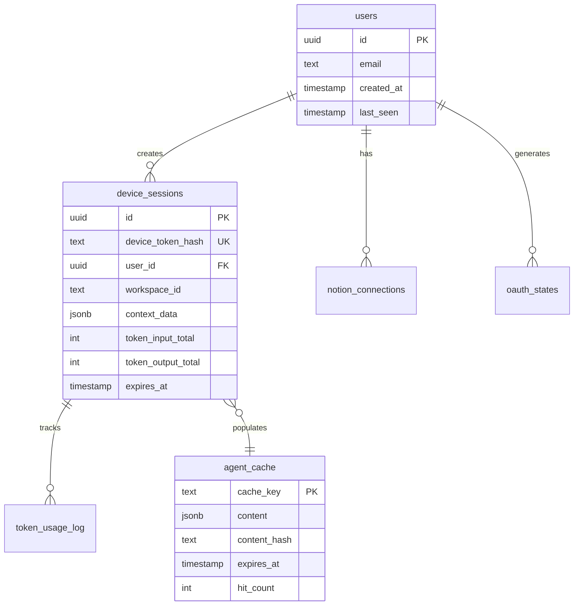

# Phase 3 (Week 3) Implementation Plan
*Alfred Agent Core MVP Development*

## Overview

**Goal**: Transform the Alfred Agent Core from a stateless prototype into a production-ready system with persistent sessions, PostgreSQL-backed caching, and comprehensive usage tracking.

**Success Metrics**: >70% cache hit rate, session continuity, token usage visibility, foundation for Week 4 streaming.

**Timeline**: Week 3 of 4-week MVP development cycle

## Foundation Status (Week 2 Complete)

### ✅ Successfully Delivered
- **Complete Notion OAuth Flow** (Issue #14): Encrypted token storage with Fernet
- **Proactive Token Refresh** (Issue #16): T-5m refresh window with single-flight pattern
- **Per-User MCP Clients** (Issue #17): Factory pattern for Notion's hosted MCP service
- **Database Infrastructure**: PostgreSQL production hardening with advisory locks
- **401 Retry Logic**: Automatic token refresh and client rebuild on authentication errors

### ✅ Current Architecture State
- FastAPI application with structured logging and error taxonomy
- MCP Router connecting to 3 remote MCP servers (47 total tools)
- In-memory cache with basic TTL support and hit/miss logging
- Encrypted OAuth tokens with proactive refresh infrastructure
- Production-ready database module with connection pooling

## Phase 3 Core Components

### 0. Cross-Cutting Priorities (CRITICAL - Do First)

#### User + Workspace Scoping
- **Never cache across users/workspaces** - All cache keys must include user_id + workspace_id
- **Session isolation** - Each user session bound to specific Notion workspace
- **Data leak prevention** - No global cache keys that could expose cross-user data

#### Deterministic Args Hashing
- **Canonical JSON** - Sort keys, strip nulls before hashing
- **Stable cache keys** - Same logical request = same cache key regardless of arg order
- **SHA256 for args hash** - Consistent, collision-resistant hashing

#### Single-Flight per Cache Key
- **Async locks in-process** - Prevent thundering herd for same cache key
- **Re-check inside lock** - Double-check pattern to avoid duplicate work
- **Optional PG advisory locks** - For multi-worker scaling (future enhancement)

#### No SQLite Anywhere
- **PostgreSQL for everything** - Tests, development, production
- **Eliminate fallbacks** - Remove any SQLite code paths

### 1. Infrastructure Foundation

#### Docker Development Stack (Issue #47) - **STATUS: ~85% COMPLETE**
**Current Status**: PostgreSQL infrastructure exists, minor polish needed

**Remaining Work**:
- Create `docker-compose.test.yml` for test database isolation
- Add database initialization script for CITEXT extension
- Standardize database configurations between compose files
- Verify all tests pass with PostgreSQL (no SQLite references)

**Note**: Core PostgreSQL setup is working - OAuth token testing infrastructure is operational.

#### Database Migrations (Issue #22) - **PRIORITY 2**
**Status**: Open - Production-shaped schema with proper types and indexes

**Schema Design** (Production-Ready):

**01_device_sessions.sql**:
```sql
CREATE TABLE IF NOT EXISTS device_sessions (
  session_id         uuid PRIMARY KEY DEFAULT gen_random_uuid(),
  user_id            uuid NOT NULL REFERENCES users(id) ON DELETE CASCADE,
  workspace_id       text,                              -- Notion workspace
  device_token_hash  bytea NOT NULL UNIQUE,             -- sha256(cookie_token)
  context_data       jsonb NOT NULL DEFAULT '{}',
  tokens_input_total bigint NOT NULL DEFAULT 0,         -- handles large token counts
  tokens_output_total bigint NOT NULL DEFAULT 0,
  created_at         timestamptz NOT NULL DEFAULT now(),
  last_accessed      timestamptz NOT NULL DEFAULT now(),
  expires_at         timestamptz NOT NULL               -- sliding expiry
);

CREATE INDEX IF NOT EXISTS idx_device_sessions_user ON device_sessions(user_id);
CREATE INDEX IF NOT EXISTS idx_device_sessions_last_accessed ON device_sessions(last_accessed);
CREATE INDEX IF NOT EXISTS idx_device_sessions_expires_at ON device_sessions(expires_at);
```

**02_agent_cache.sql**:
```sql
CREATE TABLE IF NOT EXISTS agent_cache (
  cache_key     text PRIMARY KEY,                       -- user:ws:tool:ver:args_hash
  content       jsonb NOT NULL,
  content_hash  text,                                   -- optional integrity/debug
  idempotent    boolean NOT NULL DEFAULT true,          -- read vs write tool
  created_at    timestamptz NOT NULL DEFAULT now(),
  expires_at    timestamptz NOT NULL,
  hit_count     integer NOT NULL DEFAULT 0,
  size_bytes    integer                                 -- octet_length(content)
);

-- Fast queries for live entries and cleanup
CREATE INDEX IF NOT EXISTS idx_agent_cache_expires ON agent_cache(expires_at);
CREATE INDEX IF NOT EXISTS idx_agent_cache_live ON agent_cache(cache_key)
  WHERE expires_at > now();
```

**Key Schema Improvements**:
- `bytea` for hashed tokens (more efficient than text)
- `bigint` for token counts (handles large usage without overflow)
- `timestamptz` for all timestamps (proper timezone handling)
- `idempotent` flag to distinguish read/write tools
- Partial index on live cache entries for performance
- Proper foreign key constraints with cascade deletes

### 2. Session Management System

#### Session Store Service (Issue #23) - **PRIORITY 3**
**Status**: Open - Sliding expiry with hashed tokens

**Implementation** (Production-Ready):
```python
# session_store.py - Sliding expiry with secure token hashing
import hashlib
from datetime import datetime, timezone, timedelta

SLIDING_TTL = timedelta(days=7)

def _hash_token(tok: str) -> bytes:
    """SHA256 hash of device token for secure storage"""
    return hashlib.sha256(tok.encode()).digest()

async def create_session(db, user_id, workspace_id, cookie_token):
    """Create or update device session with sliding expiry"""
    now = datetime.now(timezone.utc)
    await db.execute(text("""
      INSERT INTO device_sessions (device_token_hash, user_id, workspace_id, created_at, last_accessed, expires_at)
      VALUES (:h, :uid, :ws, :now, :now, :exp)
      ON CONFLICT (device_token_hash) DO UPDATE
        SET user_id=EXCLUDED.user_id, workspace_id=EXCLUDED.workspace_id,
            last_accessed=EXCLUDED.last_accessed, expires_at=EXCLUDED.expires_at
    """), {"h": _hash_token(cookie_token), "uid": user_id, "ws": workspace_id,
           "now": now, "exp": now + SLIDING_TTL})

async def resume_session(db, cookie_token):
    """Resume device session and slide expiry window"""
    row = (await db.execute(text("""
      SELECT session_id, user_id, workspace_id, expires_at FROM device_sessions
      WHERE device_token_hash=:h AND expires_at > now()
    """), {"h": _hash_token(cookie_token)})).first()
    if not row: return None

    # Slide expiry on every access
    await db.execute(text("""
      UPDATE device_sessions SET last_accessed=now(), expires_at=now()+(:ttl)::interval
      WHERE session_id=:sid
    """), {"sid": row.session_id, "ttl": f"{SLIDING_TTL.total_seconds()} seconds"})
    return row
```

**Device Session Strategy**:
- **Hash tokens before storage** (bytea in DB, never plaintext)
- **Sliding expiry** - Every request extends session by 7 days
- **Workspace binding** - Each session tied to specific Notion workspace
- **Minimal context** - Tool preferences, no message history or PII

### 3. PostgreSQL Cache System

#### Cache Backend Migration (Issue #24) - **PRIORITY 4**
**Status**: Open - Production-ready caching with anti-stampede protection

**Cache Key Strategy** (User-Scoped):
```python
# cache_key.py - Deterministic args canonicalization
import hashlib, json

def canonical_args(obj):
    """Strip nulls and sort keys for deterministic hashing"""
    def strip_nulls(v):
        if isinstance(v, dict):
            return {k: strip_nulls(v[k]) for k in sorted(v) if v[k] is not None}
        if isinstance(v, list):
            return [strip_nulls(x) for x in v]
        return v
    return strip_nulls(obj)

def args_hash(args: dict) -> str:
    payload = json.dumps(canonical_args(args), separators=(",", ":"), sort_keys=True)
    return hashlib.sha256(payload.encode()).hexdigest()

def make_cache_key(*, user_id: str, workspace_id: str|None, tool: str, version: str, args: dict) -> str:
    h = args_hash(args)
    ws = workspace_id or "none"
    return f"{user_id}:{ws}:{tool}:{version}:{h}"
```

**PostgreSQL Cache Backend** (Read-Through/Write-Through):
```python
# pg_cache.py - Single-flight with TTL jitter
from datetime import datetime, timezone, timedelta
from sqlalchemy import text
import asyncio

JITTER = 0.1  # 10% anti-stampede jitter
_locks: dict[str, asyncio.Lock] = {}

def ttl_with_jitter(ttl_seconds: int) -> int:
    import random
    j = int(ttl_seconds * (1 - JITTER + (2*JITTER)*random.random()))
    return max(1, j)

async def get_cache(session, key: str):
    row = await session.execute(text("""
        SELECT content, expires_at
        FROM agent_cache
        WHERE cache_key = :key AND expires_at > now()
    """), {"key": key})
    r = row.first()
    if not r: return None
    await session.execute(text("""
        UPDATE agent_cache SET hit_count = hit_count + 1 WHERE cache_key = :key
    """), {"key": key})
    return {"content": r[0], "ttl_remaining": int((r[1] - datetime.now(timezone.utc)).total_seconds())}

async def put_cache(session, key: str, content: dict, ttl_seconds: int, idempotent=True):
    exp = datetime.now(timezone.utc) + timedelta(seconds=ttl_with_jitter(ttl_seconds))
    await session.execute(text("""
        INSERT INTO agent_cache (cache_key, content, content_hash, idempotent, expires_at, size_bytes)
        VALUES (:k, :c, :ch, :idemp, :exp, octet_length(cast(:c as text)))
        ON CONFLICT (cache_key) DO UPDATE
          SET content = EXCLUDED.content, expires_at = EXCLUDED.expires_at
    """), {"k": key, "c": content, "ch": None, "idemp": idempotent, "exp": exp})

async def call_with_cache(ctx, tool_call, args, *, ttl, idempotent=True, force_refresh=False):
    key = make_cache_key(
        user_id=ctx.user_id, workspace_id=ctx.workspace_id,
        tool=tool_call.name, version=tool_call.version, args=args
    )

    if idempotent and not force_refresh:
        if hit := await get_cache(ctx.db, key):
            return hit["content"], {"meta": {"cacheHit": True, "cacheTtlRemaining": hit["ttl_remaining"]}}

    # Single-flight pattern prevents thundering herd
    lock = _locks.setdefault(key, asyncio.Lock())
    async with lock:
        # Re-check cache inside lock
        if idempotent and not force_refresh:
            if hit := await get_cache(ctx.db, key):
                return hit["content"], {"meta": {"cacheHit": True, "cacheTtlRemaining": hit["ttl_remaining"]}}

        # Execute with existing 401 retry logic
        result = await execute_with_unauthorized_retry(ctx, tool_call, args)

        # Write-through only for idempotent success
        if idempotent:
            await put_cache(ctx.db, key, result, ttl_seconds=ttl, idempotent=True)
        else:
            await invalidate_related(ctx, tool_call, args)
        return result, {"meta": {"cacheHit": False}}
```

**TTL Policy Configuration** (Environment Overridable):
```python
# ttl_policy.py
DEFAULT_TTL = {
    "notion.get_page": 4 * 3600,    # 4h (reduced from 24h for active docs)
    "notion.search":   4 * 3600,    # 4h for search results
    "notion.get_db":   4 * 3600,    # 4h for database queries
    "github.get_repo": 24 * 3600,   # 24h for repo metadata
}

def ttl_for(tool_name: str) -> int:
    # Allow overrides: CACHE_TTL_notion__get_page=86400
    import os
    key = "CACHE_TTL_" + tool_name.replace(".", "__")
    return int(os.getenv(key, DEFAULT_TTL.get(tool_name, 3600)))
```

#### Cache Control Features (Issue #25) - **PRIORITY 5**
**Status**: Open - Write invalidation and cache control

**Write-Path Invalidation Strategy**:
```python
# Targeted invalidation for Notion writes
async def invalidate_related(ctx, tool_call, args):
    if tool_call.name.startswith("notion."):
        # Invalidate specific page if we know the page_id
        page_id = args.get("page_id") or args.get("parent_page_id")
        if page_id:
            like = f"{ctx.user_id}:{ctx.workspace_id}:notion.get_page:%:{args_hash({'page_id': page_id})}%"
            await ctx.db.execute(text("DELETE FROM agent_cache WHERE cache_key LIKE :like"), {"like": like})

        # Optionally invalidate search/list caches for workspace (conservative)
        await ctx.db.execute(text("""
            DELETE FROM agent_cache
            WHERE cache_key LIKE :prefix AND (cache_key LIKE :search OR cache_key LIKE :list)
        """), {
            "prefix": f"{ctx.user_id}:{ctx.workspace_id}:notion.%",
            "search": "%:search:%", "list": "%:list:%"
        })

# Lazy cleanup (no cron needed for MVP)
async def cleanup_expired(session, limit=1000):
    await session.execute(text("""
        DELETE FROM agent_cache WHERE expires_at <= now() LIMIT :lim
    """), {"lim": limit})
```

**Response Format Enhancement**:
```json
{
  "reply": "Assistant response...",
  "meta": {
    "cacheHit": true,
    "cacheTtlRemaining": 18360,
    "tokens": {"input": 150, "output": 200, "device_total": 2500},
    "requestId": "uuid-request-id",
    "deviceToken": "dtok_opaque-token"
  }
}
```

### 4. Token Usage Tracking

#### Token Metering Service (Issue #48) - **NEW - PRIORITY 6**
**Status**: Just created - Minimal but effective usage tracking

**Implementation** (Simple Accumulation):
```python
# metering.py - Request-scoped tracking with session accumulation
@dataclass
class TokenUsage:
    input: int = 0
    output: int = 0

# In orchestrator per /chat request
usage = TokenUsage()
# ... capture from Pydantic AI RunResult.usage() ...

# Accumulate into session at request end
await db.execute(text("""
  UPDATE device_sessions
     SET tokens_input_total  = tokens_input_total + :in,
         tokens_output_total = tokens_output_total + :out,
         last_accessed = now()
   WHERE session_id = :sid
"""), {"sid": session_id, "in": usage.input, "out": usage.output})

# Return in response meta
"meta": {
  "cacheHit": true,
  "cacheTtlRemaining": 3600,
  "tokens": {"input": 150, "output": 200, "device_total": 2500},
  "requestId": "...",
  "deviceToken": "dtok_opaque-token"
}
```

**Budget Management**:
- Session-level accumulation in `tokens_input_total` and `tokens_output_total`
- Response metadata shows per-request and session totals
- Future enhancement: warnings at configurable thresholds

### 5. Documentation & Operations

#### Schema Documentation (Issue #27) - **PRIORITY 7**
**Status**: Open - Essential for team alignment

**Deliverables**:
- **Entity Relationship Diagram**: Mermaid ERD showing all table relationships
- **Cache Strategy Documentation**: Key formats, TTL policies, invalidation rules
- **API Documentation**: Updated response formats with new metadata fields
- **Operations Guide**: Database maintenance, cache management, token budgeting

**ERD Preview**:


## Implementation Priority & Dependencies

### Phase 3A: Infrastructure (Week 3, Days 1-2)
1. **Issue #47**: Docker PostgreSQL setup - *Unblocks everything*
2. **Issue #22**: Database migrations and SQLAlchemy models
3. **Verification**: All tests pass with PostgreSQL, no SQLite references

### Phase 3B: Core Services (Week 3, Days 3-4)
4. **Issue #24**: PostgreSQL cache backend implementation
5. **Issue #23**: Session store service with workspace binding
6. **Verification**: >70% cache hit rate on repeated queries

### Phase 3C: Advanced Features (Week 3, Days 5-7)
7. **Issue #25**: Cache control (forceRefresh, invalidation)
8. **Issue #48**: Token metering and budget tracking
9. **Issue #27**: Documentation and ERD
10. **Final Integration**: End-to-end testing with all features

## Testing Strategy (Minimal but Meaningful)

### Phase 3 Test Plan - Concrete Scenarios

#### 1. Cache Hit Path Verification
```python
# Test: Same idempotent call twice → 2nd should be cacheHit=true, TTL decreases
async def test_cache_hit_path():
    # First call
    resp1 = await client.post("/chat", json={"messages": [{"role": "user", "content": "get notion page X"}]})
    assert resp1.json()["meta"]["cacheHit"] is False

    # Second identical call
    resp2 = await client.post("/chat", json={"messages": [{"role": "user", "content": "get notion page X"}]})
    assert resp2.json()["meta"]["cacheHit"] is True
    assert resp2.json()["meta"]["cacheTtlRemaining"] < resp1.json()["meta"].get("cacheTtlRemaining", 999999)
```

#### 2. Force Refresh Verification
```python
# Test: Same call w/ forceRefresh=true → bypass cache, old row replaced
async def test_force_refresh():
    # Cache a call
    resp1 = await client.post("/chat", json={"messages": [...]})
    original_content = resp1.json()["reply"]

    # Force refresh should bypass cache
    resp2 = await client.post("/chat", json={"messages": [...], "forceRefresh": True})
    assert resp2.json()["meta"]["cacheHit"] is False
```

#### 3. Write Invalidation Path
```python
# Test: get_page (cache) → write page title → get_page → miss → updated content
async def test_write_invalidation():
    # Cache a page read
    resp1 = await client.post("/chat", json={"messages": [{"role": "user", "content": "get notion page ABC123"}]})
    assert resp1.json()["meta"]["cacheHit"] is False

    # Modify the page (write operation)
    await client.post("/chat", json={"messages": [{"role": "user", "content": "update notion page ABC123 title to 'New Title'"}]})

    # Read again - should miss cache due to invalidation
    resp3 = await client.post("/chat", json={"messages": [{"role": "user", "content": "get notion page ABC123"}]})
    assert resp3.json()["meta"]["cacheHit"] is False  # Cache was invalidated
```

#### 4. Session Sliding Verification
```python
# Test: Call /chat 3x → last_accessed increases, expires_at slides
async def test_device_session_sliding():
    session_token = "test-session-123"

    # Make 3 requests with same device token
    for i in range(3):
        resp = await client.post("/chat",
            json={
                "messages": [{"role": "user", "content": f"test message {i}"}],
                "deviceToken": session_token
            }
        )
        time.sleep(1)  # Small delay to observe time changes

    # Verify session was extended
    # (Check via direct DB query that expires_at was updated)
```

#### 5. Token Metering Verification
```python
# Test: After 3 calls, tokens_*_total increased; response meta aggregates
async def test_token_metering_device_sessions():
    initial_tokens = 0
    session_token = "metering-test-session"

    for i in range(3):
        resp = await client.post("/chat",
            json={
                "messages": [{"role": "user", "content": f"short message {i}"}],
                "deviceToken": session_token
            }
        )
        current_device_total = resp.json()["meta"]["tokens"].get("device_total", 0)
        assert current_device_total > initial_tokens
        initial_tokens = current_device_total
```

### Performance Verification
```bash
# >70% cache hit rate validation
pytest tests/test_cache_performance.py -v

# Session continuity across requests
pytest tests/test_session_sliding.py -v

# PostgreSQL-only operation (no SQLite fallbacks)
pytest tests/ --db=postgresql -v
```

### Success Criteria (Updated)
- [ ] **>70% cache hit rate** on repeated identical queries (measured)
- [ ] **Session sliding** works correctly with 7-day expiry extension
- [ ] **User+workspace scoping** prevents cross-user data leaks
- [ ] **Write invalidation** clears related cache entries appropriately
- [ ] **Token accumulation** reflects in session totals and response metadata
- [ ] **Single-flight** prevents duplicate work during cache misses
- [ ] **TTL jitter** prevents synchronized cache expiry stampedes

## Risk Mitigation

### Technical Risks
- **Database Migration Complexity**: Start with simple schema, iterate
- **Cache Performance**: Benchmark early, optimize TTL policies based on real usage
- **Session State Growth**: Monitor context blob sizes, implement cleanup
- **Token Tracking Overhead**: Make logging configurable, optimize queries

### Integration Risks
- **OAuth Token Compatibility**: Ensure session-user binding works with existing tokens
- **MCP Client State**: Verify per-user clients work with persistent sessions
- **Cache Invalidation**: Test write-path invalidation doesn't break existing flows

### Operational Risks
- **Database Backup**: Document backup/restore procedures
- **Migration Rollback**: Ensure all migrations are reversible
- **Monitoring**: Add health checks for cache hit rates and session counts

## Success Criteria

### Functional Requirements
- [ ] Device tokens provide conversation continuity across requests
- [ ] Cache hit rate consistently >70% on repeated identical queries
- [ ] Token usage visible in all response metadata with device accumulation
- [ ] Notion workspace binding works correctly with existing OAuth flow
- [ ] Database performance adequate for 50+ concurrent sessions

### Non-Functional Requirements
- [ ] PostgreSQL replaces all in-memory/SQLite fallbacks
- [ ] Response latency <500ms for cached reads (P95)
- [ ] Session context limited to <10KB per session (prevent bloat)
- [ ] Cache cleanup automatic with configurable retention
- [ ] Comprehensive error handling with existing error taxonomy

### Operational Requirements
- [ ] Docker development stack starts in <30 seconds
- [ ] Database migrations run automatically on container start
- [ ] All configuration via environment variables
- [ ] Monitoring endpoints for cache statistics and session counts
- [ ] Complete documentation for deployment and troubleshooting

## Week 4 Preparation

Phase 3 deliverables enable Week 4 streaming features:
- **Device Continuity**: SSE reconnection using device tokens
- **Cache Performance**: Stream responses benefit from aggressive caching
- **Token Management**: Budget tracking prevents stream cutoffs
- **Database Infrastructure**: Persistent connections for streaming workloads

Phase 3 sets the foundation for a production-ready agent core capable of handling concurrent users with persistent context, aggressive performance optimization, and comprehensive observability.
